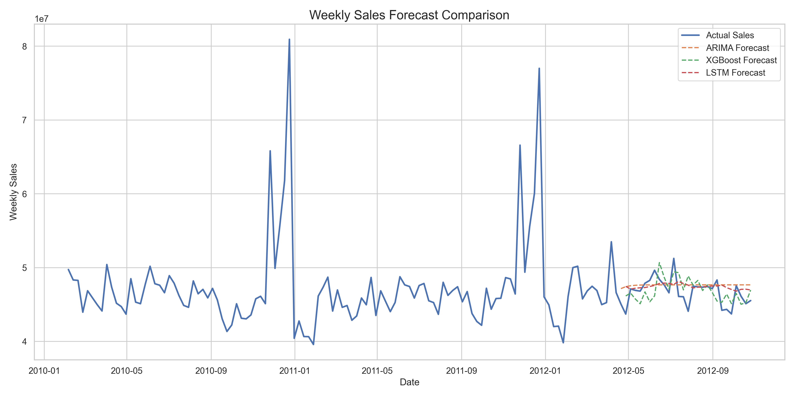

# 📈 Sales Revenue Forecasting using Machine Learning

## Overview
This project builds an end-to-end sales revenue forecasting system using Python.
It compares multiple time-series models to predict weekly sales.

## Models Used
- Moving Average (Baseline)
- ARIMA
- XGBoost
- LSTM (Deep Learning)

## Evaluation Metrics
- Mean Absolute Error (MAE)
- Root Mean Squared Error (RMSE)

## Visualization
The plot below compares actual sales with forecasts from different models.



## Tech Stack
- Python
- Pandas, NumPy
- Scikit-learn
- Statsmodels
- XGBoost
- TensorFlow
- Matplotlib, Seaborn

## How to Run
```bash
pip install -r requirements.txt
python src/step1_load_data.py
python src/step2_clean_data.py
...
python src/step11_plot_forecasts.py
